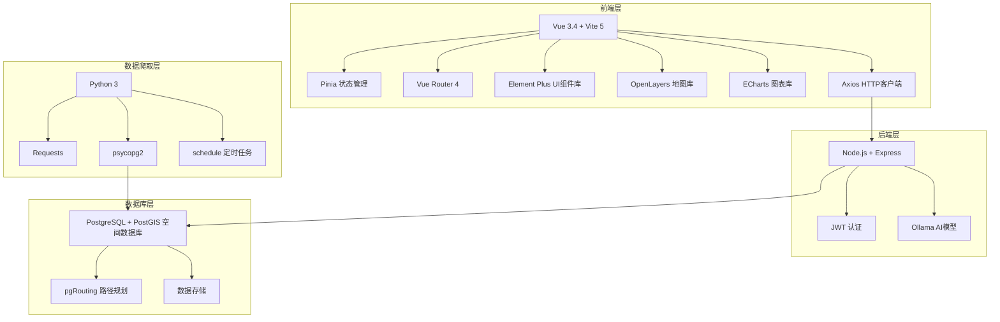

# 骑行智慧民生服务平台

基于 Vue3 + Node.js + PostgreSQL/PostGIS + OpenLayers 的全栈智慧骑行民生服务平台。

## 项目简介

本项目是一个面向城市骑行爱好者的智慧民生服务平台，集成了路线规划、组队骑行、民情上报等功能，利用空间分析技术为用户提供智能化的骑行体验。

### 核心功能

- 🗺️ **路线规划** - 支持最快/最短/最安全/风景/红色研学五种模式
- 📝 **骑行日记** - 轨迹记录、照片分享、社交互动
- 🚨 **民情上报** - 问题上报、进度跟踪、积分奖励
- 👥 **组队骑行** - 发起组队、邀请码加入
- 🤖 **AI助手** - 智能对话、语音交互
- 📊 **数据分析** - 热力图、缓冲区分析、等时圈分析

## 技术架构



## 项目结构

```
骑行智慧民生服务平台/
├── frontend/          # Vue3前端项目
│   ├── src/
│   │   ├── api/       # API接口
│   │   ├── components/# 公共组件
│   │   ├── layouts/   # 布局组件
│   │   ├── router/    # 路由配置
│   │   ├── stores/    # Pinia状态管理
│   │   ├── styles/    # 全局样式
│   │   └── views/     # 页面组件
│   ├── Dockerfile     # 前端Docker构建文件
│   └── package.json
├── backend/           # Node.js后端项目
│   ├── src/
│   │   ├── config/    # 配置文件
│   │   ├── middleware/# 中间件
│   │   └── routes/    # API路由
│   ├── Dockerfile     # 后端Docker构建文件
│   └── package.json
├── database/          # 数据库脚本
│   └── 01_init.sql    # 初始化SQL
├── data/              # 地理数据
│   ├── ganzhou_roads.geojson
│   └── 章贡区.tif
├── docker-compose.yml # Docker Compose编排文件
└── README.md          # 项目文档
```

## 快速开始

### 🚀 方式一：Docker 一键部署（推荐）

**环境要求**：只需安装 Docker Desktop

```bash
# 1. 克隆项目
git clone https://github.com/hyxvs/Smart-riding.git
cd Smart-riding

# 2. 启动所有服务（自动构建镜像）
docker-compose up -d

# 3. 等待服务启动（约30秒），然后访问
# 前端地址: http://localhost
# 后端API: http://localhost:3002
# 默认管理员: admin / 123456
```

**服务列表**：

| 服务 | 容器名称 | 端口 | 说明 |
|------|----------|------|------|
| PostgreSQL + PostGIS | cycling_db | 5432 | 空间数据库 |
| 后端 API | cycling_backend | 3002 | Node.js 服务 |
| 前端 | cycling_frontend | 80 | Vue 应用 |

**常用命令**：

```bash
# 查看所有容器状态
docker-compose ps

# 查看服务日志
docker-compose logs -f backend

# 停止服务
docker-compose down

# 停止并删除数据卷（重置数据库）
docker-compose down -v

# 重新构建并启动
docker-compose up -d --build
```

### 🛠️ 方式二：本地开发环境

#### 1. 环境要求

- Node.js >= 18
- PostgreSQL >= 14 + PostGIS >= 3
- Python >= 3.8 (可选，用于数据爬取)
- Ollama (可选，用于AI助手)

### 2. 数据库初始化

```bash
# 创建数据库
psql -U postgres -c "CREATE DATABASE cycling_smart;"

# 执行初始化脚本
psql -U postgres -d cycling_smart -f database/init.sql
```

### 3. 安装依赖

```bash
# 安装前端依赖
cd frontend && npm install

# 安装后端依赖
cd backend && npm install

# 安装Python依赖 (可选)
cd scraper && pip install -r requirements.txt
```

### 4. 配置环境变量

复制 `.env.example` 为 `.env` 并修改配置：

```env
DB_HOST=localhost
DB_PORT=5432
DB_NAME=cycling_smart
DB_USER=postgres
DB_PASSWORD=123456

JWT_SECRET=your_jwt_secret_key
JWT_EXPIRES_IN=7d

PORT=3000

OLLAMA_HOST=http://localhost:11434
OLLAMA_MODEL=qwen2.5:7b
```

### 5. 启动服务

```bash
# 启动后端 (在 backend 目录)
npm run dev

# 启动前端 (在 frontend 目录)
npm run dev
```

#### 6. 访问应用

- 前端地址: http://localhost:5173
- 后端API: http://localhost:3002
- 默认管理员: admin / 123456

## 功能模块

### 百姓端

- **首页** - 地图展示、快速操作、定位功能
- **路线规划** - 多模式路线规划、坡度分析、POI查询
- **组队骑行** - 发起组队、邀请码加入、路线绘制
- **民生上报** - 问题上报、进度跟踪、积分奖励
- **个人中心** - 用户信息、骑行统计、积分记录

### 管理端

- **数据概览** - 统计仪表盘
- **用户管理** - 用户列表、状态管理
- **民情处置** - 上报处理、派单流转
- **热力分析** - 骑行热力图
- **POI管理** - 兴趣点增删改查
- **道路管理** - 道路数据维护

## API接口

### 认证相关
- `POST /api/auth/register` - 用户注册
- `POST /api/auth/login` - 用户登录
- `GET /api/auth/me` - 获取当前用户

### 路线规划
- `POST /api/route/plan` - 规划路线
- `POST /api/route/save` - 保存路线
- `GET /api/route/list` - 路线列表
- `GET /api/route/:id` - 路线详情

### 组队骑行
- `POST /api/team/create` - 创建组队
- `GET /api/team/list` - 组队列表
- `GET /api/team/:id` - 组队详情
- `POST /api/team/join` - 加入组队
- `POST /api/team/leave` - 退出组队
- `POST /api/team/join-by-code` - 邀请码加入

### 民生上报
- `POST /api/report/create` - 创建上报
- `GET /api/report/list` - 上报列表
- `GET /api/report/:id` - 上报详情
- `PUT /api/report/:id/process` - 处理上报

### AI助手
- `POST /api/ai/chat` - AI对话
- `POST /api/ai/voice` - 语音处理

## 数据库表结构

### 基础空间层
- `road` - 道路表
- `poi` - 兴趣点表
- `traffic_realtime` - 实时路况表
- `event_livelihood` - 民生事件表

### 用户账号层
- `user` - 用户表
- `user_point` - 积分表
- `user_behavior_log` - 行为日志

### 路线规划层
- `route_plan_result` - 规划结果
- `user_route` - 用户路线

### 骑行社交层
- `ride_diary` - 骑行日记
- `diary_like` - 点赞记录
- `diary_comment` - 评论记录
- `team_ride` - 组队骑行

### 民情处置层
- `report_event` - 上报事件
- `dept` - 部门表

### 特色功能层
- `red_geofence` - 红色围栏
- `red_certificate` - 红色证书
- `ai_knowledge` - AI知识库

## 开发指南

### 添加新API
1. 在 `backend/src/routes/` 创建路由文件
2. 在 `backend/src/app.js` 引入路由
3. 在 `frontend/src/api/` 创建API调用函数

### 添加新页面
1. 在 `frontend/src/views/` 创建页面组件
2. 在 `frontend/src/router/index.js` 添加路由

### 数据库迁移
修改 `database/init.sql` 后重新执行或手动执行增量SQL。

## 部署说明

### 🐳 Docker 部署（推荐）

项目已配置完整的 Docker 环境，使用 `docker-compose.yml` 一键部署：

```bash
# 克隆项目
git clone https://github.com/hyxvs/Smart-riding.git
cd Smart-riding

# 启动所有服务
docker-compose up -d

# 查看服务状态
docker-compose ps
```

**部署架构**：

```
┌─────────────────────────────────────────────────────────────┐
│                    Docker 宿主机                            │
│  ┌──────────────┐  ┌──────────────┐  ┌──────────────┐     │
│  │   Nginx      │  │   Node.js    │  │ PostgreSQL   │     │
│  │  (前端静态)   │  │   (后端API)   │  │  + PostGIS   │     │
│  │   :80        │  │   :3002      │  │   :5432      │     │
│  └──────┬───────┘  └──────┬───────┘  └──────┬───────┘     │
│         │                 │                 │              │
│         └─────────────────┴─────────────────┘              │
│                      内部网络                               │
└─────────────────────────────────────────────────────────────┘
```

**环境变量配置**：

在 `docker-compose.yml` 中可配置以下环境变量：

| 变量 | 默认值 | 说明 |
|------|--------|------|
| POSTGRES_DB | cycling_smart | 数据库名 |
| POSTGRES_USER | postgres | 数据库用户名 |
| POSTGRES_PASSWORD | 123456 | 数据库密码 |
| DB_HOST | postgres | 数据库主机 |
| PORT | 3002 | 后端端口 |

### 📦 手动部署

#### 前端构建
```bash
cd frontend
npm install
npm run build
```

#### 后端部署
```bash
cd backend
npm install
npm start
```

#### Nginx配置示例
```nginx
server {
    listen 80;
    server_name your-domain.com;
    
    location / {
        root /path/to/frontend/dist;
        try_files $uri $uri/ /index.html;
    }
    
    location /api {
        proxy_pass http://localhost:3002;
        proxy_http_version 1.1;
        proxy_set_header Upgrade $http_upgrade;
        proxy_set_header Connection 'upgrade';
        proxy_set_header Host $host;
    }
}
```

## 技术栈

### 前端
- Vue 3.4 + Vite 5
- Pinia 状态管理
- Vue Router 4
- Element Plus UI组件库
- OpenLayers 地图库
- ECharts 图表库
- Axios HTTP客户端

### 后端
- Node.js + Express
- PostgreSQL + PostGIS 空间数据库
- pgRouting 路径规划
- JWT 认证
- Ollama AI模型

### 数据爬取
- Python 3
- Requests
- psycopg2
- schedule 定时任务

### 容器化
- Docker + Docker Compose
- Nginx (前端静态服务)

## 贡献指南

1. Fork 本项目
2. 创建功能分支 (`git checkout -b feature/amazing-feature`)
3. 提交更改 (`git commit -m 'Add some amazing feature'`)
4. 推送到分支 (`git push origin feature/amazing-feature`)
5. 打开 Pull Request

## 许可证

MIT License

## 联系方式

- 项目地址: https://github.com/hyxvs/Smart-riding.git
- 欢迎通过 GitHub Issues 联系我们

---

**骑行智慧民生服务平台** - 让骑行更智能，让民生更便捷！